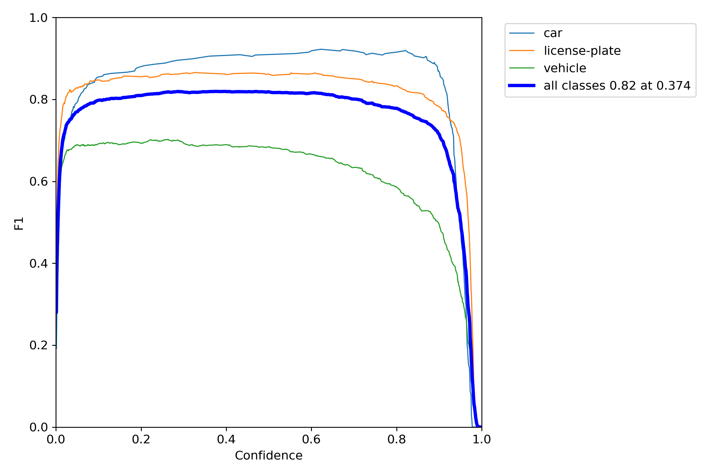

# Plate Detection

## Introduction
This is a yolov7 model that is fine-tuned to detect plates and recognize the plate from image or video.

<br>

## Datasets
I used the [Iranian plate dataset](https://github.com/SeyedHamidreza/car_plate_dataset) and added to the [roboflow license plate object detection datasets](https://public.roboflow.com/object-detection/license-plates-us-eu). I used preprocessing and data augmentation such as blur and rotation.

<br>

## Training
Training notebook (Plate_Detection_Yolov7.ipynb) is in src directory the training result was very good and reached around ~ 0.85 mAP.

### Confusion Matrix:


### F1_curve:


### R_curve:


### Whole result


<br>

## Prediction
I put 11 images in the test set to evaluate the object detection model.
* The car label means plate license


See the test_set folder for more images...

<br>

## Plate Recognition
After license plate localization, I tested 3 images for cropping and detecting the plates. The results are in plate_inference directory and named by the plate text.

### images:


<br>

### Results:


<br>

## Usage 
For using the plate cropping and ocr you should install the packages in requirements.txt and run by the following command:

```
python src/yolov7/plate_ocr.py
```